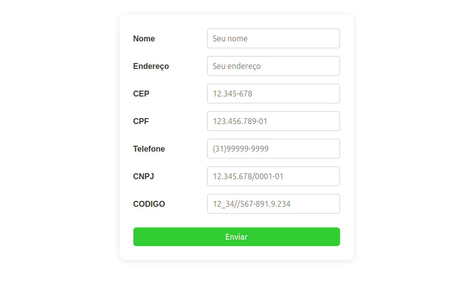

# Formulário Bonito com CSS Grid

Este projeto apresenta um formulário moderno e responsivo utilizando **CSS Grid** para alinhamento dos campos. Ideal para cadastro de informações como nome, endereço, CPF, CNPJ, telefone, CEP e código personalizado.

## 🖼️ Visual
<p align="center">
  
</p>

## 🚀 Como usar

1. Clone ou baixe este repositório.
2. Abra o arquivo `index.html` em seu navegador.
3. Preencha os campos e clique em **Enviar**.
4. Uma mensagem de confirmação será exibida.

## 📋 Funcionalidades

- Máscaras para campos como CPF, CNPJ, CEP, telefone e código.
- Layout centralizado e responsivo.
- Feedback visual ao enviar o formulário.

## 🛠️ Tecnologias


## 📁 Estrutura

```
├── index.html
├── style.css
└── script.js
```

## ✨ Personalização

Você pode adaptar os campos, estilos e validações conforme sua necessidade!

---

<p align="center">
  
</p>
